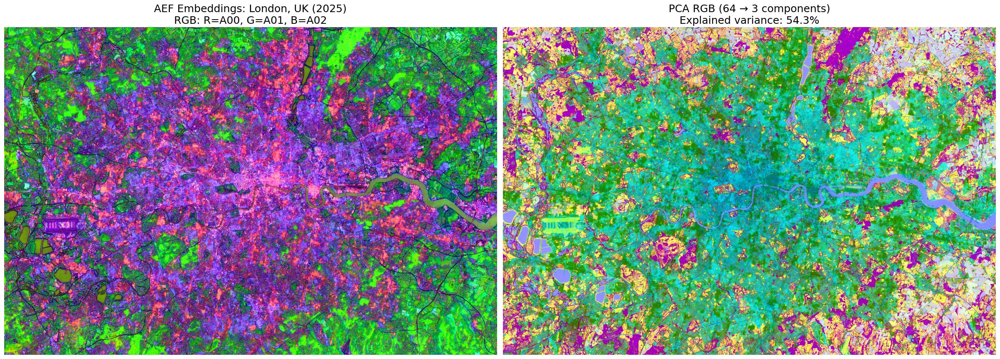
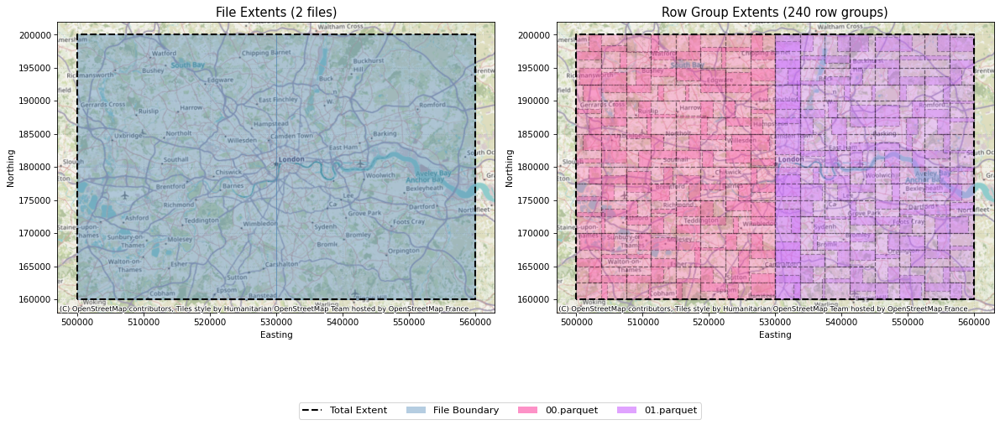

# aef-bng

Reproject [Alpha Earth Foundation embeddings](https://deepmind.google/blog/alphaearth-foundations-helps-map-our-planet-in-unprecedented-detail/) from their native UTM grids onto the British National Grid (EPSG:27700) in Delta or GeoParquet format.

<p align="center">
  
</p>
<p align="center"><em>Alpha Earth embeddings for London, UK (2025).</a></em></p>

## Why?

Google Deepmind publishes the AEF embeddings dataset as an annual, global, 10m-resolution
embedding layers as multiband Cloud Optimised GeoTIFFs. These are available via Google Cloud
Storage or [Source Cooperative](https://source.coop/repositories/tge-labs/aef); this project solely
uses the latter.

Other projects exist for creating virtual Zarr files on-the-fly
([`aef-loader`](https://github.com/jakenotjay/aef-loader)) or premade mosaics
([`aef-mosaic`](https://source.coop/tge-labs/aef-mosaic)). These are amazing and I would strongly
recommend using them in the first instance, particularly for raster-based workflows.

I regularly use Databricks which _currently_ does not support native raster workflows, whereas they do have great native support for vector processing. My work also primarily covers Great Britain, so I wanted something indexed to the British National Grid. As such, I needed a simple way to work with Alpha Earth embeddings in a tabular format locally (via GeoParquet) or on Databricks (via Delta).

This work is currently a proof-of-concept to serve specific niche use case in getting Alpha Earth data in a tabular format on Databricks.

## How it works

### Pipeline overview

```
  AEF COG tiles (UTM, S3)
          |
          v
  +------------------+
  | STAC GeoParquet   |  Queried directly from Source Cooperative S3
  | tile index        |  with predicate pushdown (no download needed)
  +------------------+
          |
          v
  Enumerate 10km BNG chunks covering requested bounds
          |
          v
  For each (chunk, year):
    1. Spatial query: find overlapping AEF tiles (filtered to BNG extent)
    2. Read COGs from S3 (async-geotiff)
    3. Reproject UTM -> BNG at 10m resolution (rasterio.warp)
    4. Merge overlapping tiles (first-valid, deterministic order by tile path)
    5. Extract valid pixels -> (bng_ref, year, embedding)
          |
          v
        Output
```
### Spark/Databricks

Distributes chunk processing across a Spark cluster using `mapInArrow`:

1. The tile index is loaded on the driver, pickled, and captured in the UDF closure
2. A DataFrame of `(chunk, year)` combinations is repartitioned (~3 chunks per partition)
3. Each partition runs a **single asyncio event loop** for all S3 reads
4. Results are written to a Unity Catalog Delta table with `optimizeWrite` and `autoCompact`

Compatible with dedicated job clusters, all-purpose compute, serverless, and Databricks Connect (no `sparkContext` dependency).

Apply liquid clustering after processing for spatial/temporal query performance:

```sql
ALTER TABLE `catalog`.schema.table CLUSTER BY (year, bng_ref)
```

### Local

Two-phase write strategy using [`geoparquet-io`](https://github.com/cholmes/geoparquet-io):

1. **Stream**: PyArrow `ParquetWriter` appends chunks to a raw temp file with O(row_group)
memory (~8 MB) to prevent data accumlation in RAM.
2. **Optimise**: `gpio` CLI sorts and partitions:
   - Hilbert curve spatial sorting for optimal row locality within files
   - KD-tree spatial partitioning for uniform distribution across files targeting ~15M rows/file
   (~1 GB). Partition count is the nearest power of 2: e.g. 195M rows → 16 files × 12.2M rows each.
   - GeoParquet 2.0 with `geo_bbox` row group statistics enabling spatial filter pushdown
   - 100k row groups
   - Zstd compression

### Tile index

The AEF tile index is a [STAC GeoParquet](https://stac-utils.github.io/stac-geoparquet/latest/) file on Source Cooperative S3. The pipeline queries it directly with predicate pushdown on `bbox` and `datetime` columns — only the rows overlapping the requested BNG extent and years are downloaded. Tiles outside the BNG grid are filtered out with spatial predicate pushdown filters.

### COG orientation

AEF COGs are "bottom-up": the origin is at the bottom-left corner and the y-resolution is positive, which is the inverse of a standard top-down COG. [Source Cooperative's README](https://source.coop/tge-labs/aef#object-object) recommends using the companion `.vrt` files to correct this for software that assumes standard row ordering.

This pipeline reads the raw `.tiff` files directly and does not need the VRTs. `async_geotiff` reads the affine transform from the TIFF tags and returns it with the data, and `rasterio.warp.reproject` uses that transform to correctly map pixel coordinates to world coordinates regardless of y-scale sign. The windowed read helper in `reader.py` also handles this explicitly by transforming all four geographic corners to pixel space (rather than assuming two corners suffice), which is necessary to avoid a negative window height when y-resolution is positive.

### Output schemas

Both modes use the same flat embedding representation of 64 individual `TINYINT` columns (`A00`..`A63`).

|     Column    |       Type      |                             Description                               |
|---------------|-----------------|-----------------------------------------------------------------------|
|   `bng_ref`   |     `STRING`    |           10-character 10m BNG reference (e.g. `TQ30008000`)          |
|     `year`    |     `SMALLINT`  |                       Year of the AEF embeddings                      |
| `A00`..`A63`  |     `TINYINT`   |                 64 individual int8 embedding band columns             |
|   `easting`   |     `INTEGER`   |             BNG easting of the lower-left cell corner (metres)        |
|   `northing`  |     `INTEGER`   |            BNG northing of the lower-left cell corner (metres)        |
|   `geometry`  |     `GEOMETRY`  |                     10m BNG cell polygon (EPSG:27700)                 |


### Processing units

The pipeline divides Great Britain into 10km BNG grid squares (e.g. `TQ38`). Each square is 1000x1000 pixels at 10m resolution, up to 1M rows per chunk. These are internal processing units and do not appear in the output.

## Installation

Clone the repo locally, Makefile available for convenience for installing required & optional dependencies:

```bash
git clone https://github.com/jordanp-dluhc/aef-bng
cd aef-bng
make install
```

If you only want to install the required dependencies:

```bash
uv sync
```

For the Spark & Databrick-Connect dependency:

```bash
uv sync --extra spark
```

For the CLI command to generate visualisations of partitioned data:

```bash
uv sync --extra viz
```

## Usage

### Databricks

#### Interactive (notebook)

See [`notebooks/aef_bng_databricks.ipynb`](https://github.com/jordanp-dluhc/aef-bng/blob/main/notebooks/aef_bng_databricks.ipynb) for a walkthrough. Install the package on your cluster and call `process_with_spark(config)` directly.

#### Automated (Databricks Asset Bundle)

Two DAB templates are provided — copy one to `databricks.yml` and fill in your workspace/catalog details:

| Template | Compute | Startup time | Spark config |
|----------|---------|--------------|--------------|
| `databricks.template.cluster.yml` | Dedicated job cluster | ~5-10 minutes | Full control |
| `databricks.template.serverless.yml` | Serverless | Instant | Fixed by runtime |

```bash
# Setup
cp databricks.template.serverless.yml databricks.yml  # or cluster variant
# Edit: workspace URL, catalog, schema, node type

# Deploy and run
databricks bundle deploy -t dev
databricks bundle run aef_bng_pipeline -t dev \
    --params bounds=508848,163362,553002,196746 \
    --params years=2024,2025 \
    --params "table_name=`your-catalog`.schema.table"
```

The DAB builds the wheel automatically (`uv build --wheel`), uploads it, and runs the job with the specified parameters.

### CLI (local mode)

Largely for quick development work.

See [`notebooks/aef_bng_local_example.ipynb`](https://github.com/jordanp-dluhc/aef-bng/blob/main/notebooks/aef_bng_local_example.ipynb).

```bash
# Process a single year for all of GB (uses default BNG bounds)
aef-bng process --year 2025 \
    --output ./aef

# Process specific bounds for multiple years (central London)
aef-bng process \
    --year 2024 --year 2025 \
    --bounds 521722 171089 540290 187123 \
    --output ./london_aef

# Larger bounds with more concurrent workers
aef-bng process \
    --year 2025 \
    --bounds 508848 163362 553002 196746 \
    --workers 8 \
    --output ./london_aef
```

### Visualising output

The `visualise` command inspects a GeoParquet output directory and produces two files:

- **`spatial_partitioning.png`**: static plot showing file extents and row-group extents on a basemap
- **`spatial_partitioning.html`**: interactive [`lonboard`](https://developmentseed.org/lonboard/latest/) map coloured by file, openable in any browser

```bash
# Custom output paths
aef-bng visualise london_aef/2025 \
    --png london_aef/london_partitioning.png \
    --html london_aef/london_partitioning.html
```

<p align="center">
  
</p>
<p align="center"><em>Example local GeoParquet partitions.</a></em></p>

## Development

Run the Makefile command for running code checks (pre-commit, `uv-sort`):

```bash
make check
```

Or individual groups:

```bash
uv sync --group dev
uv run ruff check .
uv run ruff format .
```

Run testing suite:

```bash
make test
```

Or individually:

```bash
uv run pytest --cov --cov-config=pyproject.toml --cov-report=xml --color=yes
```

Running nox:

```bash
make nox
```

Or individually:

```bash
uv run nox
```

## Architecture

```
aef_bng/
  cli.py          Click CLI entry point (process, visualise)
  spark_cli.py    Hidden spark-run command (called by DAB python_wheel_task)
  config.py       Configuration dataclass with validation
  constants.py    AEF and BNG constants (nodata, CRS, resolution, S3 paths)
  dequantise.py   int8 -> float32 dequantisation (numpy, Arrow, pandas, PySpark)
  extract.py      Vectorised BNG reference generation, WKB geometry, Arrow table extraction
  grid.py         BNG output grid enumeration and ChunkSpec
  index.py        AEF STAC GeoParquet index (direct S3 query with predicate pushdown)
  pipeline.py     Local async pipeline orchestration (stream + optimise)
  reader.py       Async COG reading via obstore + async-geotiff
  reproject.py    UTM -> BNG reprojection and first-valid tile merging
  spark.py        Distributed Spark pipeline (mapInArrow, serverless/cluster compatible)
  types.py        BoundingBox with CRS reprojection
  visualise.py    Spatial partitioning visualiser (static PNG + lonboard HTML map)
  writer.py       Streaming writer + gpio optimization (Hilbert sort, KD-tree, GeoParquet 2.0)

databricks.template.cluster.yml      DAB template — dedicated job cluster
databricks.template.serverless.yml   DAB template — serverless compute
```
