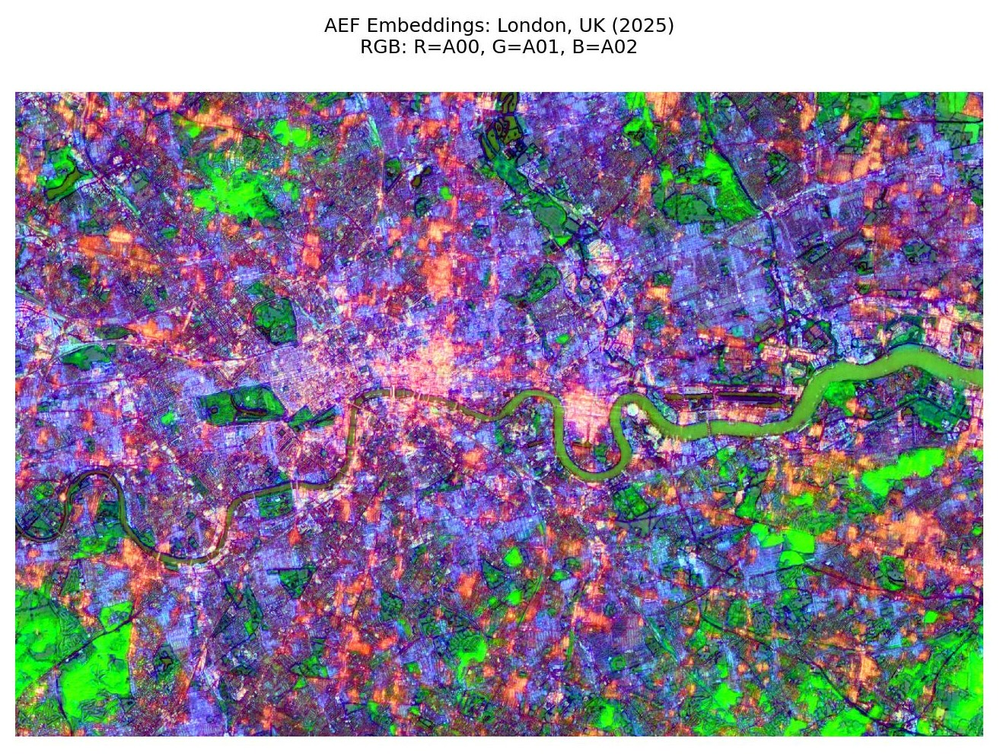

# aef-bng

Reproject [Alpha Earth Foundation embeddings](https://deepmind.google/blog/alphaearth-foundations-helps-map-our-planet-in-unprecedented-detail/) from their native UTM grids onto the British National Grid (EPSG:27700) in Delta or GeoParquet format.

<p align="center">
  
</p>
<p align="center"><em>Alpha Earth embeddings for London, UK (2025).</a></em></p>

## Why

Google Deepmind publishes the AEF embeddings dataset as an annual, global, 10m-resolution embedding layers as multiband Cloud Optimised GeoTIFFs. These are available via Google Cloud Storage or [Source Cooperative](https://source.coop/repositories/tge-labs/aef); this project solely uses the latter.

I regularly use Databricks which _currently_ does not support native raster workflows, whereas they do have great native support for vector processing. My work also primarily covers Great Britain, so I wanted something indexed to the British National Grid. As such, I needed a simple way to work with Alpha Earth embeddings in a tabular format locally (via GeoParquet) or on Databricks (via Delta).

Other projects exist for creating virtual Zarr files on-the-fly ([`aef-loader`](https://github.com/jakenotjay/aef-loader)) or premade mosaics ([`aef-mosaic`](https://source.coop/tge-labs/aef-mosaic)). These are amazing and I would strongly recommend using them in the first instance, particularly for raster-based workflows.

This work is currently a proof-of-concept to serve specific niche use case in getting Alpha Earth data in a tabular format on Databricks.

## How it works

### Pipeline overview

```
  AEF COG tiles (UTM, S3)
          |
          v
  +------------------+
  | STAC GeoParquet   |  Queried directly from Source Cooperative S3
  | tile index        |  with predicate pushdown (no download needed)
  +------------------+
          |
          v
  Enumerate 10km BNG chunks covering requested bounds
          |
          v
  For each (chunk, year):
    1. Spatial query: find overlapping AEF tiles (filtered to BNG extent)
    2. Read COGs from S3 (async-geotiff)
    3. Reproject UTM -> BNG at 10m resolution (rasterio.warp)
    4. Merge overlapping tiles (first-valid, deterministic order by tile path)
    5. Extract valid pixels -> (bng_ref, year, embedding)
          |
          v
        Output
```

### Tile index

The AEF tile index is a [STAC GeoParquet](https://stac-utils.github.io/stac-geoparquet/latest/) file on Source Cooperative S3. The pipeline queries it directly with predicate pushdown on `bbox` and `datetime` columns — only the rows overlapping the requested BNG extent and years are downloaded. Tiles outside the BNG grid are filtered out with spatial predicate pushdown filters.

### Output schemas

Both modes use the same flat embedding representation — 64 individual `TINYINT` columns (`A00`..`A63`).

|     Column    |       Type      |                             Description                               |
|---------------|-----------------|-----------------------------------------------------------------------|
|   `bng_ref`   |     `STRING`    |           10-character 10m BNG reference (e.g. `TQ30008000`)          |
|     `year`    |     `SMALLINT`  |                       Year of the AEF embeddings                      |
| `A00`..`A63`  |     `TINYINT`   |                 64 individual int8 embedding band columns             |
|   `geometry`  |     `GEOMETRY`  |                     10m BNG cell polygon (EPSG:27700)                 |

#### Local

Writes GeoParquet per 10km chunk.

GeoParquet files are written via [`geoparquet-io`](https://github.com/cholmes/geoparquet-io), with `shapely` for fast vectorised geometry construction. All spatial optimisations are delegated to geoparquet-io:

- **Bbox covering column** — computed by `add_bbox()` via DuckDB spatial
- **Hilbert curve spatial sorting** — via `sort_hilbert()` for optimal row-group locality
- **KD-tree spatial partitioning** — for datasets above ~5M rows, `partition_by_kdtree()` creates spatially-balanced files; smaller datasets write a single file
- Zstd compression, ~100k row groups

#### Spark/Databricks

Writes to a Unity Catalog Delta table.

Liquid clustering on `(year, bng_ref)` is applied for efficient temporal and spatial queries, but if it is a managed table _I think_ you can apply `CLUSTER BY AUTO` to allow Databricks to determine optimisations by query patterns.

### Processing units

The pipeline divides Great Britain into **10km BNG grid squares** (e.g. `TQ38`). Each square is 1000x1000 pixels at 10m resolution — up to 1M rows per chunk. These are internal processing units and do not appear in the output.

## Installation

A Makefile has been included for ease of use, install all project dependency groups, pre-commit etc.:

```bash
make install
```

If you want to install require dependencies:

```bash
uv sync
```

For Spark/Databricks usage:

```bash
uv sync --extra spark
```

## Usage

### CLI (local mode)

```bash
# Process a single year for all of GB (uses default BNG bounds)
aef-bng process --year 2025 \
    --output ./london_aef

# Process specific bounds (Central London area) for a single year
aef-bng process \
    --year 2025 \
    --bounds 521722 171089 540290 187123 \
    --output ./london_aef

# Process specific bounds for multiple years
aef-bng process \
    --year 2024 --year 2025 \
    --bounds 521722 171089 540290 187123 \
    --output ./london_aef
```

### Databricks

See `notebooks/aef_bng_databricks.ipynb` for a complete walkthrough covering installation, configuration, running the pipeline, verification, and query examples.

You could also execute this using [`databricks-connect`](https://pypi.org/project/databricks-connect/) and the [Databricks VS Code extension](https://docs.databricks.com/aws/en/dev-tools/vscode-ext/) for running code locally via a Databricks cluster.

## Development

Run the Makefile command for running code checks (pre-commit, `uv-sort`):

```bash
make check
```

Or individual groups:

```bash
uv sync --group dev
uv run ruff check .
uv run ruff format .
```

Run testing suite:

```bash
make test
```

Or individually:

```bash
uv run pytest --cov --cov-config=pyproject.toml --cov-report=xml --color=yes
```

Running nox:

```bash
make nox
```

Or individually:

```bash
uvx nox
```

## Architecture

```
aef_bng/
  cli.py          Click CLI entry point
  config.py       Configuration dataclass with validation
  constants.py    AEF and BNG constants (nodata, CRS, resolution, S3 paths)
  dequantise.py   int8 -> float32 dequantisation (numpy, Arrow, pandas)
  extract.py      Vectorised BNG reference generation, WKB geometry, Arrow table extraction
  grid.py         BNG output grid enumeration and ChunkSpec
  index.py        AEF STAC GeoParquet index (direct S3 query with predicate pushdown)
  pipeline.py     Local async pipeline orchestration
  reader.py       Async COG reading via obstore + async-geotiff
  reproject.py    UTM -> BNG reprojection and first-valid tile merging
  spark.py        Distributed Spark pipeline (mapInArrow + Unity Catalog)
  types.py        BoundingBox with CRS reprojection
  writer.py       GeoParquet writer (geoparquet-io: bbox, Hilbert sort, KD-tree partition)
```

## Further documentation

- [Spark pipeline](docs/spark-pipeline.md) — How `mapInArrow` distributes chunk processing, writes to Unity Catalog, and cluster tuning recommendations (GDAL threading, `spark.task.cpu`).
